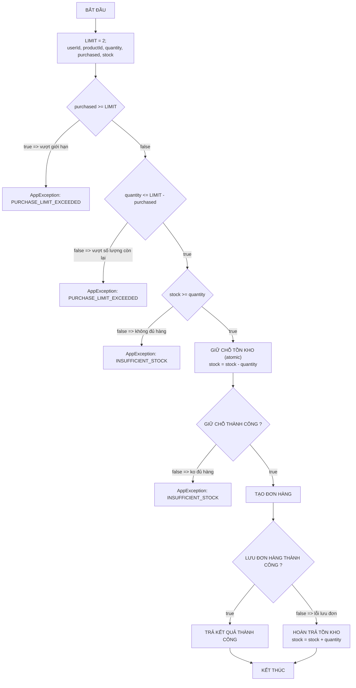
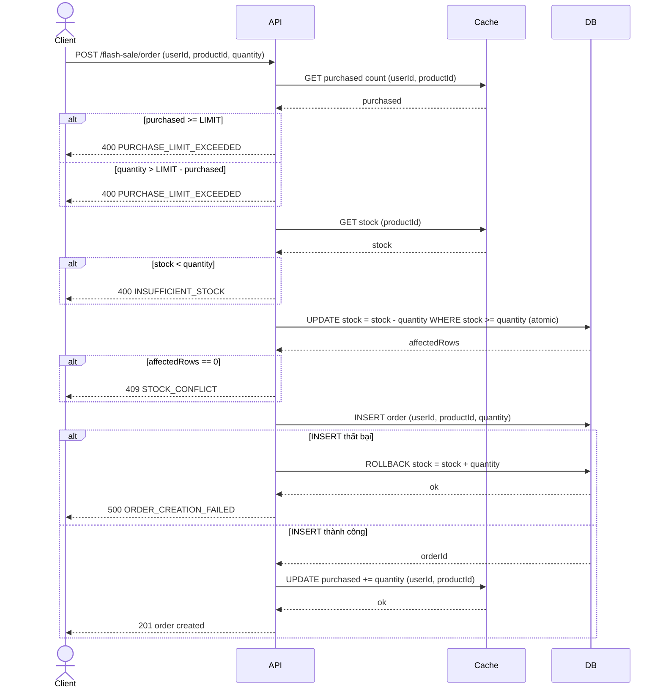

# Backend Flash Sale

Tài liệu này mô tả kiến trúc và luồng hoạt động của một hệ thống backend đơn giản được thiết kế để xử lý bài toán Flash Sale.

## 1. Giới thiệu bài toán

Flash Sale là hình thức bán hàng trong đó một sản phẩm được giảm giá mạnh trong một khoảng thời gian ngắn với số lượng có hạn. Mô hình này thường thu hút một lượng lớn truy cập trong thời gian ngắn, đặt ra thách thức lớn cho hệ thống backend về hiệu năng và tính nhất quán của dữ liệu.

Hệ thống cần xử lý đồng thời nhiều yêu cầu mua hàng, đảm bảo các ràng buộc nghiệp vụ không bị vi phạm và dữ liệu (đặc biệt là tồn kho) phải luôn chính xác.

## 2. Mục tiêu của hệ thống

*   **Đảm bảo tính đúng đắn:** Mỗi người dùng chỉ được mua số lượng sản phẩm trong giới hạn cho phép.
*   **Quản lý tồn kho chính xác:** Ngăn chặn tuyệt đối việc bán quá số lượng sản phẩm có trong kho (overselling).
*   **Xử lý truy cập đồng thời:** Xử lý hiệu quả lượng truy cập lớn và các yêu cầu đồng thời (race condition) để đảm bảo tính toàn vẹn của dữ liệu.
*   **Đảm bảo tính nhất quán:** Dữ liệu tồn kho và đơn hàng phải luôn nhất quán, ngay cả khi có lỗi xảy ra trong quá trình xử lý.

## 3. Các ràng buộc nghiệp vụ

*   Mỗi người dùng được mua tối đa `LIMIT = 2` sản phẩm cho mỗi đợt Flash Sale.
*   Không thể hoàn tất đơn hàng nếu số lượng yêu cầu vượt quá tồn kho hiện tại.
*   Thao tác cập nhật tồn kho phải là một giao dịch nguyên tử (atomic) để tránh sai lệch dữ liệu.

## 4. Luồng xử lý chính của hệ thống

1.  Hệ thống nhận yêu cầu mua hàng từ người dùng bao gồm `userId`, `productId`, và `quantity`.
2.  Truy vấn cơ sở dữ liệu để lấy tổng số lượng sản phẩm người dùng đã mua trước đó.
3.  Nếu người dùng đã mua đủ số lượng giới hạn (`LIMIT`), từ chối yêu cầu.
4.  Nếu số lượng đang yêu cầu cộng với số lượng đã mua vượt quá `LIMIT`, từ chối yêu cầu.
5.  Truy vấn cơ sở dữ liệu để lấy số lượng tồn kho của sản phẩm.
6.  Nếu tồn kho không đủ cho số lượng yêu cầu, từ chối yêu cầu.
7.  Thực hiện trừ tồn kho một cách nguyên tử tại cơ sở dữ liệu. Đây là bước quan trọng để tránh race condition.
8.  Nếu việc trừ tồn kho thất bại (do một request khác đã lấy mất hàng), từ chối yêu cầu.
9.  Nếu trừ tồn kho thành công, tiến hành tạo đơn hàng cho người dùng.
10. Nếu quá trình tạo đơn hàng gặp lỗi, hệ thống phải hoàn trả lại số lượng tồn kho đã trừ trước đó để đảm bảo tính nhất quán.
11. Nếu mọi bước thành công, trả về thông báo tạo đơn hàng thành công cho người dùng.

## 5. Kiến trúc xử lý request

Kiến trúc của hệ thống bao gồm hai thành phần chính:

*   **API Server:** Tiếp nhận request từ client, chứa đựng toàn bộ logic nghiệp vụ và giao tiếp trực tiếp với cơ sở dữ liệu.
*   **Database (DB):** Nơi lưu trữ dữ liệu bền vững, là nguồn dữ liệu chính xác (source of truth) cho tồn kho và thông tin đơn hàng.

## 6. Sơ đồ luồng nghiệp vụ

## 7. Sơ đồ sequence xử lý request

## 8. Các cơ chế đảm bảo tính đúng đắn của hệ thống

*   **Kiểm tra giới hạn mua hàng:** Logic kiểm tra được thực hiện ở tầng ứng dụng bằng cách truy vấn trực tiếp từ cơ sở dữ liệu trước khi thực hiện các thao tác chính.
*   **Cập nhật tồn kho nguyên tử (Atomic Update):** Đây là cơ chế cốt lõi để chống race condition. Hệ thống sử dụng một câu lệnh SQL duy nhất để vừa kiểm tra, vừa cập nhật tồn kho: `UPDATE products SET stock = stock - ? WHERE id = ? AND stock >= ?`. Câu lệnh này đảm bảo rằng việc giảm tồn kho chỉ xảy ra nếu số lượng tồn kho tại thời điểm thực thi vẫn đủ. Cơ sở dữ liệu sẽ khóa (lock) hàng dữ liệu trong quá trình cập nhật, đảm bảo tính nguyên tử.
*   **Cơ chế Rollback:** Trong trường hợp việc tạo đơn hàng ở DB thất bại sau khi đã trừ tồn kho, hệ thống phải thực hiện một thao tác ngược lại (hoàn trả tồn kho) để đảm bảo dữ liệu không bị sai lệch.

## 9. Các lỗi nghiệp vụ có thể xảy ra

*   `PURCHASE_LIMIT_EXCEEDED`: Người dùng đã mua đủ số lượng giới hạn hoặc yêu cầu mua số lượng vượt quá giới hạn còn lại.
*   `INSUFFICIENT_STOCK`: Số lượng tồn kho không đủ để đáp ứng yêu cầu.
*   `STOCK_CONFLICT`: Xung đột xảy ra khi nhiều yêu cầu cùng cập nhật tồn kho, và yêu cầu hiện tại thất bại do tồn kho đã bị một yêu cầu khác thay đổi.
*   `ORDER_CREATION_FAILED`: Lỗi xảy ra trong quá trình lưu đơn hàng vào cơ sở dữ liệu.

## 10. Hướng mở rộng hệ thống

Mặc dù hệ thống hiện tại đã giải quyết được bài toán cốt lõi, có nhiều hướng để cải tiến và mở rộng trong tương lai:

*   **Tích hợp Caching:** Để giảm tải cho cơ sở dữ liệu và tăng tốc độ phản hồi, có thể thêm một lớp cache (ví dụ: Redis) để lưu các dữ liệu thường xuyên đọc như tồn kho sản phẩm.
*   **Sử dụng hàng đợi (Message Queue):** Thay vì xử lý tạo đơn hàng một cách đồng bộ, hệ thống có thể đẩy yêu cầu vào một hàng đợi (như RabbitMQ, Kafka). Một worker riêng sẽ xử lý các yêu cầu này một cách bất đồng bộ. Cách tiếp cận này giúp API phản hồi client gần như tức thì và tăng khả năng chịu lỗi của hệ thống.
*   **Phân tách dịch vụ (Microservices):** Chia nhỏ hệ thống thành các dịch vụ chuyên biệt như Dịch vụ Đơn hàng, Dịch vụ Sản phẩm, Dịch vụ Người dùng để dễ dàng phát triển, triển khai và mở rộng độc lập.
*   **Giám sát và Cảnh báo (Monitoring & Alerting):** Tích hợp các công cụ như Prometheus, Grafana để theo dõi sức khỏe hệ thống (tải, độ trễ, tỷ lệ lỗi) và thiết lập cảnh báo khi có sự cố.
*   **Mở rộng cơ sở dữ liệu:** Sử dụng các kỹ thuật như Read Replicas để giảm tải cho DB chính, hoặc Sharding nếu dữ liệu quá lớn.